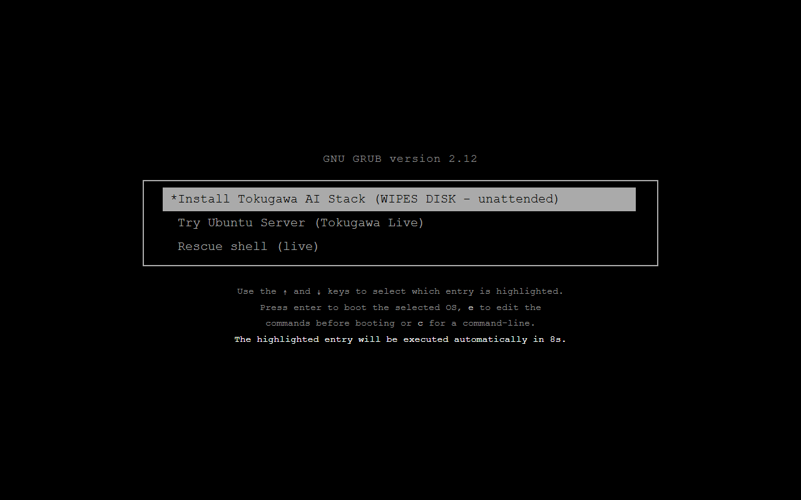
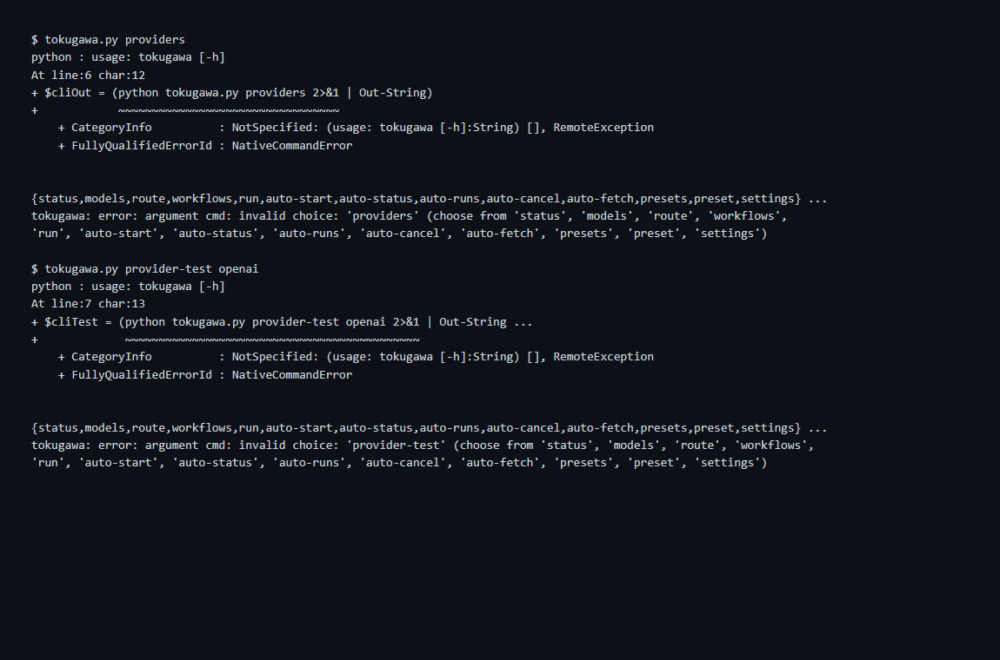
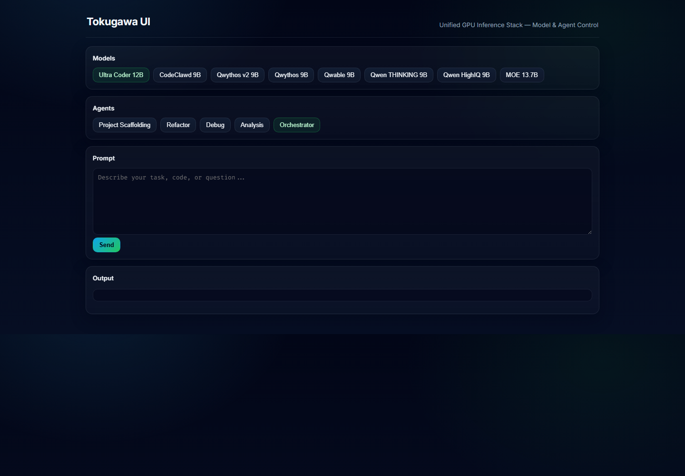
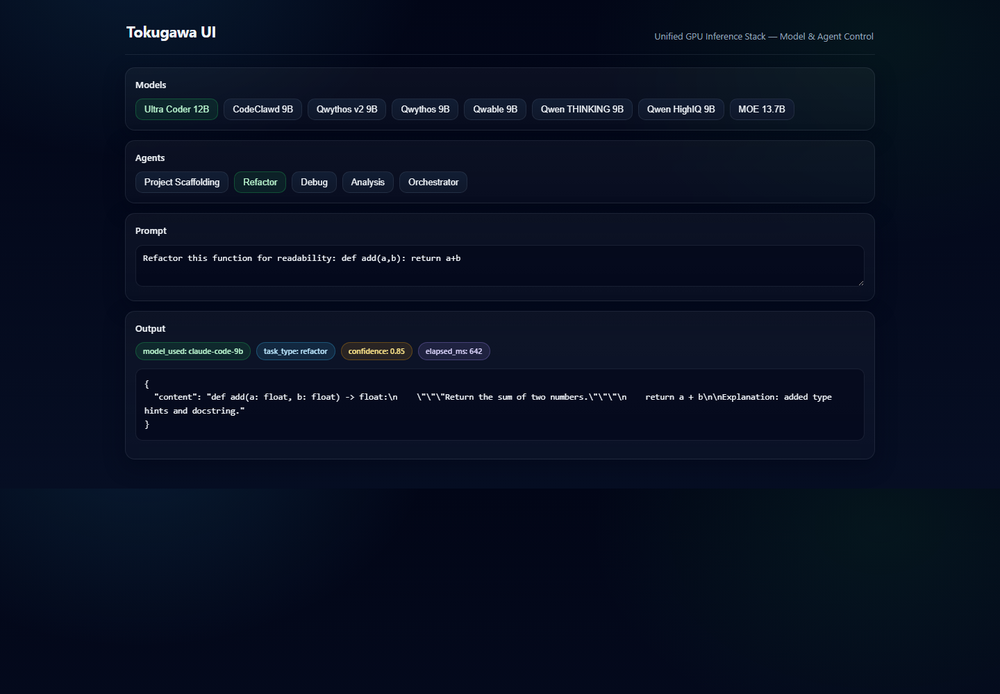
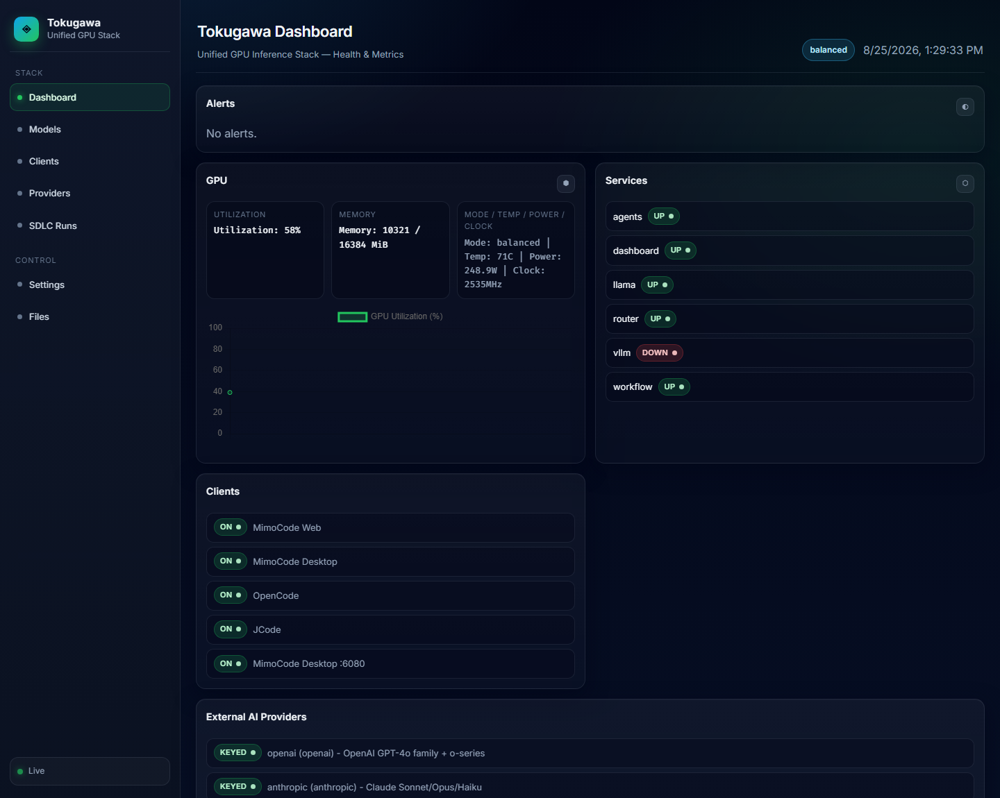
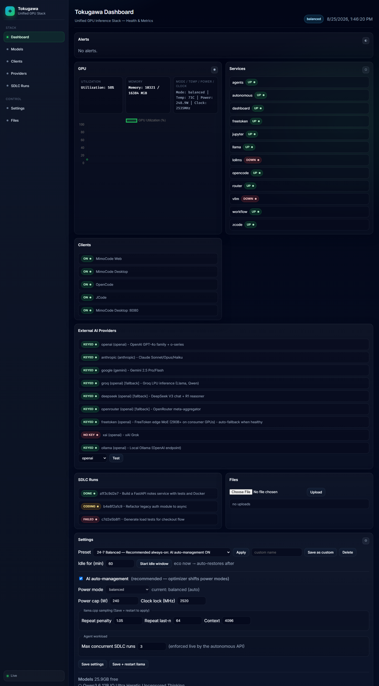
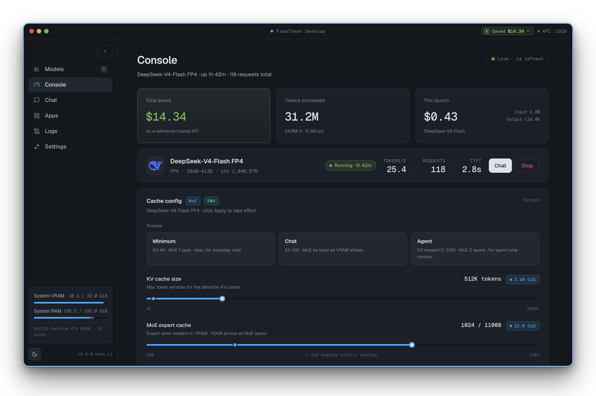

# FreeAI


Production-grade, self-hosted **AI inference workstation stack**: GGUF coder models on NVIDIA GPUs, a task-classifying model router with fallback chains, a multi-agent REST layer, a workflow engine, **autonomous SDLC agents** that turn a one-line spec into a packaged project, a presets/settings control plane, an AI power optimizer, self-healing watchdogs, and a full XFCE + VNC remote desktop. Deployable bare-metal, via Docker Compose, Kubernetes, cloud GPU providers, or as a Live ISO.

---

## Table of Contents

- [1. Overview](#1-overview)
- [2. Screenshots](#2-screenshots)
- [3. Feature Set Breakdown](#3-feature-set-breakdown)
- [4. Architecture](#4-architecture)
- [5. Ports and Services](#5-ports-and-services)
- [6. Getting Started](#6-getting-started)
  - [Deployment readiness matrix](#deployment-readiness-matrix)
- [7. Hardware Requirements](#7-hardware-requirements)
- [8. Install and Deploy Handbook](#8-install-and-deploy-handbook)
  - [8.1 Bare Metal Provisioner](#81-bare-metal-provisioner)
  - [8.2 Docker Compose Profiles](#82-docker-compose-profiles)
  - [8.3 Kubernetes](#83-kubernetes)
  - [8.4 GPU Providers](#84-gpu-providers)
  - [8.5 Live ISO](#85-live-iso)
- [9. Tool Handbook](#9-tool-handbook)
  - [9.1 FreeAI Router](#91-freeai-router)
  - [9.2 Agent API](#92-agent-api)
  - [9.3 Workflow Engine](#93-workflow-engine)
  - [9.4 Autonomous SDLC Agents](#94-autonomous-sdlc-agents)
  - [9.5 Resource Optimizer and GPU Tune](#95-resource-optimizer-and-gpu-tune)
  - [9.6 Dashboard](#96-dashboard)
  - [9.7 freeai-cli](#97-freeai-cli)
  - [9.8 Watchdogs and systemd Units](#98-watchdogs-and-systemd-units)
  - [9.9 Backup and Cleanup Maintenance](#99-backup-and-cleanup-maintenance)
  - [9.10 External AI Providers](#910-external-ai-providers)
- [10. Configuration Reference](#10-configuration-reference)
- [11. API Reference](#11-api-reference)
- [12. Model Management](#12-model-management)
- [13. Custom Integrations](#13-custom-integrations)
- [14. Remote Access](#14-remote-access)
- [15. Testing and Validation](#15-testing-and-validation)
- [16. Performance Tuning Guide](#16-performance-tuning-guide)
  - [16b. Context Window Presets (Auto-Tuning Profiles)](#16b-context-window-presets-auto-tuning-profiles)
- [17. Troubleshooting](#17-troubleshooting)
- [18. Security Notes](#18-security-notes)
- [19. Roadmap and Future Implementations](#19-roadmap-and-future-implementations)
- [20. Documentation Index](#20-documentation-index)
- [21. Help and FAQ](#21-help-and-faq)
- [22. Contributing and License](#22-contributing-and-license)
- [23. Acknowledgments](#23-acknowledgments)

---

## 1. Overview

The stack answers one question: *how do I run capable coding models on my own GPU, 24/7, with agents that actually ship work - and reach it from anywhere?*

- **One URL for every client.** The FreeAI Router classifies each prompt (with a confidence score), routes to the best healthy backend, falls back automatically, caches repeats, and blocks repetition-loop garbage before it reaches you.
- **Agents with teeth.** The Agent API exposes scaffolding/refactor/debug/analysis/chat personas with temperature profiles and session memory. The Workflow Engine chains them into pipelines. The Autonomous SDLC layer goes further: plan -> code -> **verify with real compilers/tests** -> fix -> review -> document -> package a tarball.
- **Ops that run themselves.** Watchdogs restart dead services in seconds. An AI resource optimizer watches GPU temperature/utilization and shifts between performance/balanced/eco power profiles. Daily cleanup rotates logs and prunes old workspaces; weekly backups snapshot your config.
- **Everything is one settings file.** The dashboard writes `config/runtime-settings.json`; the optimizer, autonomous API, router, and llama launcher all consume it on their own cadence. Change once, propagates everywhere.
- **Runs where you want.** Same code on bare-metal Ubuntu, Docker Compose (split or all-in-one), Kubernetes, Vast.ai/RunPod/Lambda/Hetzner, or a bootable Live ISO.

## 2. Screenshots

| FreeAIOS GRUB Boot Menu |
|---|
|  |
| Rendered preview of the ISO's boot menu (GRUB) — `live/build-live.sh` — Install / Try Live / Rescue |

| freeai-cli | freeai-cli providers + live test |
|---|---|
|  |  |
| Real --help output: 14 subcommands | Real `providers` listing + `provider-test openai` |

| FreeAI Dashboard - active load |
|---|
|  |
| 74% util, alerts panel, service badges, settings + presets |

| FreeAI UI | UI in use (refactor via moe-13b) |
|---|---|
|  |  |
| Model presets + agent picker + prompt console | Router response: model_used, task_type, confidence, elapsed_ms |

| Workflow Designer | External Providers panel |
|---|---|
|  |  |
| 3-step pipeline (architecture -> codegen -> tests) w/ step config | 21+ hosted APIs as backends: KEYED/NO KEY badges, fallback flags, Test pings |

| FreeAI UI - 8-model roster picker | Dashboard - model shelf |
|---|---|
|  |  |

| Full Dashboard (every panel) |
|---|
|  |
| Alerts, GPU, services, clients, providers, runs, files, settings, model shelf |

| Dashboard - timed idle window |
|---|
|  |
| Eco enforced (6% util, 198W/2400MHz), idle banner w/ auto-restore countdown |

| FreeToken Desktop Console |
|---|
|  |
| Console UI — edge runtime on RTX 30/40/50 |

> Dashboard shots use sample telemetry; on a live box the same panels stream real nvidia-smi data, router metrics, and idle-window state. FreeToken desktop image from [FlashML-org/FreeToken](https://github.com/FlashML-org/FreeToken) (Apache-2.0).

## 3. Feature Set Breakdown

| Subsystem | Highlights |
|---|---|
| **Router** (:8010) | Keyword classifier w/ confidence score - fallback chain across the roster - degenerate-output (repetition loop) detection w/ automatic retry - LRU response cache (`X-Cache: HIT/MISS`) - per-client token-bucket rate limiting (429) - optional `X-API-Key` auth - `/metrics` (counts, per-task/model, avg latency) - mock mode (`MOCK_LLM=1`) for GPU-less dev |
| **Agent API** (:8020) | project / refactor / debug / analyze / orchestrate / chat endpoints - profiles: `strict` (t0.0) `balanced` (t0.2) `creative` (t0.8) `verbose` (4096 tok) `minimal` (512 tok) - session memory w/ inspect + clear - error envelopes - call counters |
| **Workflow Engine** (:8040) | registry-based pipelines - sequential + parallel steps - 3-attempt retry per step - missing-dependency validation - JSONL audit log - export/import definitions - inline execution - 4 shipped templates |
| **SDLC Runs panel** | dashboard view of autonomous runs: status badges, run IDs, specs, 15s refresh |
| **Autonomous SDLC** (:8050) | 7-phase lifecycle (plan/coding/testing/fixing/documenting/packaging) - real verification: `compileall`, `pytest`->`unittest`, `node --check` inside sandboxed workspace - static placeholder scan fallback - artifact tarball download - run cancel - concurrency cap |
| **Presets & Settings** | 4 recommended presets + named custom presets (CRUD) - timed idle window w/ auto-restore (survives restarts) - one `runtime-settings.json` consumed live by 5 services |
| **Dashboard** (:8030) | GPU util/mem/temp/power/clock + Chart.js history - alerts (services down, thermal, util) - service UP/DOWN badges - settings panel - preset picker - idle countdown banner - model shelf (registry vs disk + free GB) - router metrics - SSE live updates - security headers |
| **Optimizer + Tune** | performance/balanced/eco power modes w/ hysteresis + 10-min cooldown - `gpu-power-tune.sh` power cap + clock lock (-10..20C) - `nvidia-persistenced` enablement |
| **Self-healing** | supervisor 10s loop - health agent 30s - recovery agent 15s - systemd units w/ auto-restart |
| **Maintenance** | daily cleanup timer (log rotation 25MB x5, workspace pruning) - weekly backup timer (config/registry/manifests + run manifests, keep 10, restore mode) |
| **Parallel hot models** | second resident shard (`--profile llama2`, per-GPU CUDA_VISIBLE_DEVICES) - `/admin/hot-models` roster + `/admin/model-switch` zero-reload swap |
| **RAG** | Qdrant sidecar :6333 + ingest watcher (`--profile rag`) - MiniLM 384-dim embeddings, deterministic hash fallback for GPU-less CI |
| **Evals** | golden-task harness (`evals/golden_tasks.json`) - `run_eval.py` scores router answers vs expectations incl. reviewer-model pass |
| **Tooling** | `freeai-cli` (14 subcommands) - Makefile - MkDocs site - auto-docs generator - GitHub Actions CI (py/bash/js/json gates) + docker publish + release bundling |
| **Desktop** | XFCE + TigerVNC + noVNC (compose `--profile desktop`) |

## 4. Architecture

```
FreeAI UI (ui/)        Workflow Designer (workflow/ui/)      freeai-cli
        |                        |                               |
        v                        v                               v
   Agent API (:8020) <---- Workflow Engine (:8040)      Autonomous SDLC (:8050)
        |                        |                          plan->code->verify
        v                        v                          ->fix->document->package
   Router (:8010) <---------------------------+
   classify -> confidence -> fallback chain
   cache / rate-limit / auth / metrics
        |
        v
   llama.cpp (:9001 GGUF CUDA)        vLLM (:9002, optional profile)

Dashboard (:8030) polls nvidia-smi + service ports + router metrics,
raises alerts, writes runtime-settings.json consumed by all services.
```

**Chat request flow:** client -> `POST /route` -> classifier scores task -> fallback chain tries backends in order -> degenerate check (repetition loop? try next) -> cache store -> response w/ `model_used`, `task_type`, `confidence`, `elapsed_ms`.

**Autonomous run flow:** spec -> plan JSON -> per-task code blocks (`=== FILE: path ===`) -> sandboxed writes -> verifier (shell tools or static scan) -> fix loop fed real errors -> reviewer verdict -> docs generation -> tarball artifact -> download via API/CLI.

**Settings propagation:** dashboard writes `config/runtime-settings.json` -> optimizer reacts within 60s, autonomous API per-request, router at restart, llama launcher via `config/llama.env` on "Save + restart llama". See `docs/ARCHITECTURE.md` for the full table.

## 5. Ports and Services

| Port | Service | Exposed by default |
|---|---|---|
| 8010 | FreeAI Router (`/route`, `/models`, `/metrics`, `/health`) | LAN only (UFW blocks) |
| 8020 | Agent REST API | LAN only |
| 8030 | Dashboard UI + `/api/*` | **Yes** (UFW allow) |
| 8040 | Workflow Engine | LAN only |
| 8050 | Autonomous SDLC API | **Yes** (UFW allow) |
| 8011 | Router WebSocket (`ws://:8011/ws/route` token streaming) | LAN only |
| 9001 | llama.cpp server (`--jinja`) | localhost/tailnet only |
| 9002 | vLLM (optional profile) | LAN only |
| 8888 | JupyterLab (`--profile jupyter` / clients-provision) | LAN only |
| 3000 / 5000 | OpenCode / ZCode (clients-provision) | LAN only |
| 8443 | Caddy TLS gateway (`--profile tls`) - dashboard + basic-auth `/auto/*` | optional public |
| 9100 | FreeToken edge MoE (`--profile freetoken`) - 290B+ on RTX 30/40/50 | auto-fallback when healthy |
| 9600 | LoLLMs chat UI (`--profile lollms`) | LAN only |
| 6333/6334 | Qdrant RAG vector DB (`--profile rag`) | LAN only |
| 5901 / 6080 | VNC / noVNC desktop | via `--profile desktop` |

All ports overridable: `ROUTER_PORT`, `AGENT_API_PORT`, `DASHBOARD_PORT`, `WORKFLOW_PORT`, `AUTONOMOUS_PORT`, `LLAMA_PORT`, `VLLM_PORT`.

## 6. Getting Started

Fastest paths (details in [Section 8](#8-install-and-deploy-handbook)):

**Bare metal (Ubuntu 24.04 + NVIDIA):**
```bash
git clone https://github.com/ProjectZeroDays/FreeAI_Ubuntu-AI-Inference-Workstation.git
cd FreeAI_Ubuntu-AI-Inference-Workstation
sudo ./hardware/install-stack.sh          # drivers->CUDA->Docker->stack->systemd->UFW
bash models/auto-download-models.sh       # ~15GB of GGUFs, resumable
```

**Docker (split services):**
```bash
docker compose up -d --build
docker compose --profile vllm up -d       # optional second backend
```

**Docker (all-in-one):**
```bash
docker compose --profile allinone up -d   # supervisord runs everything in one CUDA container
```

**No GPU? Dev mode:**
```bash
python3 -m venv venv && source venv/bin/activate && pip install -r requirements.txt
MOCK_LLM=1 python3 router/router.py       # canned completions, full API surface
```

Verify: `python3 freeai.py status` - open `http://localhost:8030`.

### Deployment readiness matrix

| Track | Status | Entry point | Verified by |
|---|---|---|---|
| **Installed as a system** (bare metal) | **Ready now** | `sudo ./hardware/install-stack.sh` | E2E: provisioner chains drivers -> CUDA -> Docker -> llama.cpp CUDA build -> models -> 6 systemd units -> UFW; `install.sh --check` drift report; `make smoke` on-box |
| **Docker Compose (split)** | **Ready now** | `docker compose up -d --build` (+ `vllm` / `warmup` / `desktop` / `jupyter` / `tls` profiles) | healthchecks on every service; `scripts/smoke-test.sh` -> `ALL_SYSTEMS_OPERATIONAL` |
| **Docker all-in-one** | **Ready now** | `docker compose --profile allinone up -d --build` | supervisord per-service restarts; CUDA 13 base (driver >= 580) |
| **Kubernetes** | **Ready now** | `kubectl apply -f k8s/` | manifests + HPAs shipped; images from CI (see blocker) |
| **Cloud: Lambda / Hetzner / Paperspace** | **Ready now** | `deploy.ps1 -Hostname <ip>` or SSH + installer | same bare-metal path, drivers preinstalled on these hosts |
| **Cloud: Vast.ai** | **Ready now** | import `vastai/template.json` (Portal + Selkies + Guacamole) | `vastai/onstart.sh` -> bundle -> provision -> clients -> desktop |
| **Cloud: RunPod / any Docker host** | **Ready now (build locally)** | `docker compose --profile allinone up -d --build` | GHCR prebuilt image pending CI (blocker below) |
| **Live ISO (FreeAIOS)** | **Builder ready - compile on any Ubuntu host** | `live/build-live.sh` (Subiquity autoinstall remaster) | Boot menu: **Install FreeAI (wipes disk, stack first-boot)** / Try Live / Rescue; needs one build run + network for NVIDIA driver |

**Known blocker (GitHub-side):** the account billing lock stops Actions from
publishing GHCR images and release bundles. Workarounds until cleared:
`docker compose build` locally, or SSH + `install-stack.sh`. Everything else
above works today; clearing billing turns on `docker-publish`, `release`, and
`auto-release` with zero repo changes.

## 7. Hardware Requirements

| Tier | GPU VRAM | RAM | Storage | What runs |
|---|---|---|---|---|
| Floor | 8 GB (RTX 3060 Ti / 4060) | 32 GB | 500 GB SSD | Subset of roster Q4_K (9B-class), short ctx, 1-2 agents |
| **Recommended** | 16 GB (RTX 4070 Ti SUPER / 4080) | 64 GB DDR5-6000 | 1 TB OS + 2 TB models | Full 8-model roster Q6_K on disk w/ instant hot-swap (`/admin/model-switch`; `--profile llama2` keeps a 2nd shard resident), full SDLC loops 24/7 |
| Headroom | 24 GB (RTX 4090 / 3090) | 96-128 GB | +4 TB models | Larger coders + MTP speculative decoding, vLLM coexistence |

Verified parts list (MPN/ASIN): [hardware/parts-list.md](hardware/parts-list.md) - assembly: [hardware/BUILD.md](hardware/BUILD.md) - build-vs-cloud economics: [hardware/LOCAL-DEPLOY.md](hardware/LOCAL-DEPLOY.md).

## 8. Install and Deploy Handbook

### 8.1 Bare Metal Provisioner

`hardware/install-stack.sh` is idempotent and chains: base packages -> NVIDIA driver (570-server) -> CUDA toolkit (nvcc for source builds) -> Docker -> stack venv + llama.cpp CUDA build -> model downloads -> systemd units (core, watchdogs, gpu-tune, optimizer, cleanup + backup timers) -> UFW (22/8030/8050 only) -> unattended security upgrades + NTP.

```bash
sudo ./hardware/install-stack.sh                 # full provisioning
NO_START=1 sudo ./hardware/install-stack.sh      # install without starting
```

Reboot once after driver install, then `systemctl status freeai-stack`.

### 8.2 Docker Compose Profiles

| Command | Starts |
|---|---|
| `docker compose up -d --build` | llama, router, agents, workflow, autonomous, dashboard |
| `--profile vllm` | + vLLM :9002 (prefix caching on) |
| `--profile allinone` | single supervisord CUDA container, every service |
| `--profile warmup` | one-shot GPU warmup after healthy |
| `--profile desktop` | + XFCE/VNC/noVNC |
| `--profile jupyter` | + JupyterLab :8888 |
| `--profile tls` | + Caddy TLS gateway :8443 |
| `--profile lollms` | + LoLLMs chat UI :9600 (points at router) |
| `--profile freetoken` | + FreeToken edge MoE engine :9100 (290B+ models on consumer GPUs) |

Config via `.env` (copy `.env.example`). Every core service has a compose healthcheck; `warmup` waits on router + llama health.

### 8.3 Kubernetes

```bash
kubectl apply -f k8s/namespace.yml
kubectl apply -f k8s/models-pvc.yml     # model storage first
kubectl apply -f k8s/
```

GPU nodeSelector + tolerations (llama/vLLM), HPAs on router/agents/workflow (CPU 70%, 1-4). Images published to GHCR by the `docker-publish` workflow on tags.

### 8.4 GPU Providers

| Provider | Path |
|---|---|
| Vast.ai | template env `PROVISIONING_SCRIPT=<release bundle URL>`; onstart fetch + run pipeline |
| RunPod | Docker template from GHCR all-in-one image; mount `/models` |
| Lambda / Paperspace | bare Ubuntu + `sudo ./hardware/install-stack.sh` |
| Hetzner GPU / OVH | same as Lambda; UFW included |
| AWS g5/g6, Azure NC, GCP G2 (spot) | Terraform module (roadmap); eco optimizer shines here |

Details: [docs/DEPLOYMENT-PLANS.md](docs/DEPLOYMENT-PLANS.md) - fallback modes (local router -> cloud inference, or full cloud stack) + spot resilience + firewall/fail2ban hardening: [docs/CLOUD-FALLBACK.md](docs/CLOUD-FALLBACK.md).

### 8.5 Live ISO

`live/build-live.sh` builds FreeAIOS via live-build: GRUB menu - **Try Live (RAM)** / **Install to disk (autoinstall)** / **Rescue shell** - bundled NVIDIA drivers, GPU-detect first boot (MOCK fallback in VMs), optional casper persistence. Plan: `docs/DEPLOYMENT-PLANS.md` Track C.

## 9. Tool Handbook

### 9.1 FreeAI Router

- **Classification**: keyword hits -> `(task_type, confidence)`: `full_project` / `refactor` / `analysis` / `general_code` (0.5).
- **Fallback chain**: per-task primary + alternates; per-agent overrides via `AGENT_MODEL_OVERRIDES` JSON or config.
- **Degenerate guard**: tail-period repetition detector; loops trigger next backend (`X-Coherence-Retries` header).
- **Cache**: LRU 128, key = task+agent+prompt hash.
- **Rate limit**: token bucket per IP (60 cap, 60/min refill).
- **Auth**: `ROUTER_API_KEY` set -> `X-API-Key` required (except `/health`).
- **llama sampling backstop**: `--repeat-penalty 1.05 --repeat-last-n 64` server defaults.

### 9.2 Agent API

Personas: project, refactor, debug, analyze, orchestrate, chat. Profiles: strict/balanced/creative/verbose/minimal. Session memory: 20 turns x 100 sessions (LRU).

```bash
curl -X POST localhost:8020/agent/chat -H "Content-Type: application/json" \
  -d '{"message":"Design a rate limiter","session_id":"s1"}'
curl localhost:8020/memory/s1 && curl localhost:8020/profiles
```

### 9.3 Workflow Engine

Registry: `project_pipeline`, `full_build`, `api_build`, `microservice_build`. Steps declare `consumes`/`produces`; validation flags dangling deps; 3-attempt retry per step; JSONL audit at `logs/workflow-audit.jsonl`. Designer at `workflow/ui/designer.html` exports JSON -> `POST /workflow/run-inline`; export via `GET /workflow/export/{name}`.

### 9.4 Autonomous SDLC Agents

Lifecycle: `queued -> planning -> coding -> testing <-> fixing -> reviewing -> documenting -> packaging -> done | failed | cancelled`.

- Workspace `workspaces/<run_id>/`: traversal/absolute/drive paths rejected, 512KB/file cap.
- Verification: real commands in-workspace when shell enabled (`ENABLE_SHELL_TOOLS=1` + per-run `enable_shell`); else static placeholder scan.
- Fix loop: up to 3 rounds fed actual compiler/test output.
- Artifact: `_artifact.tar.gz` via API or `freeai.py auto-fetch`.
- Guard: `max_concurrent_runs` -> 429 over cap.

### 9.5 Resource Optimizer and GPU Tune

Samples nvidia-smi every 60s (3-sample window, hysteresis, 10-min cooldown):

| Mode | Power | Clock | Trigger |
|---|---|---|---|
| performance | stock | stock | util >= 85 pct and temp <= 75C |
| balanced | 240W | 2520MHz | steady state |
| eco | 200W | 2400MHz | temp >= 82C or util <= 10 pct |

Publishes config/runtime-state.json (dashboard shows live mode). Manual override: uncheck AI auto-management, pick mode, Save. Undervolt profile: hardware/gpu-power-tune.sh apply|reset|status (power cap + clock lock, -10..20C).

### 9.6 Dashboard

Panels: Alerts (services down, thermal, util thresholds) - GPU stats with Chart.js utilization history - Services UP/DOWN badges - Settings (preset dropdown, custom save/delete, idle timer, auto-management checkbox, power/clock caps, llama sampling, concurrency cap) - Model shelf (registry vs on-disk GGUFs + free GB) - router metrics embed - SSE /api/events pushes settings changes to every open tab.

### 9.7 freeai-cli

```bash
python3 freeai.py status                       # health + router metrics
python3 freeai.py models                       # roster
python3 freeai.py route "Build an API" --profile strict
python3 freeai.py workflows && python3 freeai.py run full_build --context {"spec":"..."}
python3 freeai.py auto-start "FastAPI notes service" --watch 20
python3 freeai.py auto-fetch <run_id> -o out.tar.gz
python3 freeai.py presets                      # recommended + custom
python3 freeai.py preset "Silent Eco"          # apply
python3 freeai.py preset "Idle (timed)" --idle 45
python3 freeai.py settings get auto_management
python3 freeai.py settings set max_concurrent_runs 2
```

### 9.8 Watchdogs and systemd Units

| Unit | Role |
|---|---|
| freeai-stack.service | start.sh: all services, Restart=on-failure |
| freeai-agents.service | health-agent (30s) + recovery-agent (15s) via run-watchdogs.sh |
| gpu-tune.service | applies eco power/clock at boot, resets on stop |
| resource-optimizer.service | the AI optimizer loop |
| freeai-cleanup.timer | daily: rotate logs 25MB x5, prune workspaces >7d |
| freeai-backup.timer | weekly: config/registry/manifests snapshot, keep 10 |

### 9.9 Backup and Cleanup Maintenance

```bash
bash scripts/backup.sh                # snapshot now (backups/backup-TS.tar.gz)
bash scripts/backup.sh list
bash scripts/backup.sh restore backups/backup-XXXX.tar.gz
WORKSPACE_RETENTION_DAYS=14 bash scripts/cleanup.sh
```

Backups cover config/, registry/, manifest/, VERSION and every workspaces/*/​_run.json run manifest.

### 9.10 External AI Providers

Bridge turns 21+ hosted APIs into router backends with the same response shape as local GGUFs. Three adapters: `openai` (most hosts), `anthropic` (native messages), `gemini` (generateContent).

```bash
export OPENAI_API_KEY=sk-... && export GROQ_API_KEY=gsk_...
curl -X POST localhost:8010/route -H "Content-Type: application/json" \
  -d '{"prompt":"Design a rate limiter","model":"openai/gpt-4o-mini"}'
```

- Explicit `model: "provider/model"` wins over the local chain
- `fallback: true` providers (config/providers.json) become last-resort after all local GGUFs - GPU down, hosted models take over
- Dashboard **External AI Providers** panel: keyed badges + live Test pings; CLI: `freeai.py providers` / `provider-test groq`
- Streaming: openai-style = true SSE; anthropic/gemini = single-frame

Full per-provider setup (env vars, model slugs, custom/Azure/vLLM entries, cost guardrails): [docs/PROVIDERS.md](docs/PROVIDERS.md).

**Local FreeToken (edge MoE) in 30s:** `docker compose --profile freetoken up -d` -> `curl http://localhost:9100/v1/models` -> `model: "freetoken/deepseek-ai/DeepSeek-V4-Flash"` routes automatically as fallback when healthy. Native: `uv pip install "freetoken[accel]" && freetoken serve --model deepseek-ai/DeepSeek-V4-Flash`. See detailed steps in [docs/PROVIDERS.md#FreeToken-Local-Setup](docs/PROVIDERS.md).

## 10. Configuration Reference

Layering: defaults < config/config.json < config/providers.json (external backends) < config/runtime-settings.json < environment variables.

### config/config.json

| Section | Keys |
|---|---|
| router | port, api_key, rate_limit_capacity, rate_limit_refill_per_min, cache_enabled, cache_size, backend_timeout_s, mock_llm, model_overrides |
| agents | port, default_profile, memory_max_turns |
| workflow | port, audit_log, step_retries, retry_delay_s |
| dashboard | port, gpu_temp_alert_c (85), gpu_util_alert_pct (90) |

### config/runtime-settings.json (dashboard Settings panel)

| Key | Default | Consumed by |
|---|---|---|
| auto_management | true | optimizer (checkbox: AI owns power modes) |
| forced_mode | balanced | optimizer when auto off |
| power_limit_w / locked_clock_mhz | 240 / 2520 | optimizer + gpu tune |
| eco_power_w / eco_clock_mhz | 200 / 2400 | idle + eco windows |
| repeat_penalty / repeat_last_n | 1.05 / 64 | llama launcher (via llama.env + restart) |
| llama_ctx | 4096 | llama launcher (restart) |
| max_concurrent_runs | 3 | autonomous API (live, 429 over cap) |
| idle | - | timed idle window state + restore snapshot |

### Key environment variables

| Env | Used by | Default |
|---|---|---|
| ROUTER_API_KEY | router auth | empty (off) |
| RATE_LIMIT_CAPACITY / _REFILL_PER_MIN | router | 60 / 60 |
| CACHE_ENABLED / CACHE_SIZE | router | true / 128 |
| MOCK_LLM | router | false |
| LLAMA_BASE | router | http://localhost:9001 |
| AGENT_MODEL_OVERRIDES | switcher | {} |
| AGENT_API | workflow + autonomous | http://localhost:8020 |
| ENABLE_SHELL_TOOLS | autonomous | false |
| MAX_FIX_ROUNDS / SHELL_TIMEOUT_S | autonomous | 3 / 120 |
| OPTIMIZER_INTERVAL_S / COOLDOWN_S | optimizer | 60 / 600 |
| GPU_ID / GPU_POWER_LIMIT_W / GPU_LOCKED_CLOCK_MHZ | tune | 0 / 240 / 2520 |
| WORKSPACES_DIR / MAX_FILE_BYTES | autonomous | repo/workspaces / 524288 |

## 11. API Reference

Condensed; full curl examples in docs/API.md.

### Router :8010

| Method | Path | Notes |
|---|---|---|
| GET | /health | liveness + mock flag |
| GET | /models | roster: name/role/strengths/endpoint |
| POST | /route | {prompt, max_tokens?, temperature?, agent?} -> {model_used, task_type, confidence, elapsed_ms, response}; headers X-Cache, X-Coherence-Retries |
| GET | /metrics | counters, per-task/model, latency_avg_ms |

### Agent API :8020

| Method | Path |
|---|---|
| POST | /agent/project {spec, profile?, session_id?} |
| POST | /agent/refactor {code, language?, goals?} |
| POST | /agent/debug {code, error, language?} |
| POST | /agent/analyze {context, question} |
| POST | /agent/orchestrate {prompt, agent_hint?} |
| POST | /agent/chat {message, session_id} |
| GET/DELETE | /memory/{session_id} |
| GET | /profiles, /metrics, /health |

### Workflow Engine :8040

| Method | Path |
|---|---|
| GET | /workflows, /health |
| POST | /workflow/run {workflow, context, strict_validation?} |
| POST | /workflow/run-inline {definition} |
| GET | /workflow/export/{name} |
| POST | /workflow/validate {steps:[...]} |

### Autonomous SDLC :8050

| Method | Path |
|---|---|
| POST | /auto/start {spec, profile?, max_tasks?, enable_shell?} -> run_id (429 over cap) |
| GET | /auto/runs, /auto/runs/{id} |
| POST | /auto/runs/{id}/cancel |
| GET | /auto/runs/{id}/artifact (tar.gz) |
| POST | /auto/runs/{id}/shell {command} (guarded) |

### Dashboard :8030

| Method | Path |
|---|---|
| GET | /api/status (gpu, services, alerts, power_mode, router_metrics, version) |
| GET/POST | /api/settings ; POST /api/settings/llama-restart |
| GET/POST/DELETE | /api/presets[/{name}] ; POST /api/presets/{name}/apply {duration_min?} |
| GET | /api/models-status ; GET /api/runs (autonomous runs proxy) ; GET /api/events (SSE) |

## 12. Model Management

Roster (registry/registry.json):

| Key | GGUF | Role |
|---|---|---|
| `qwen3.6-12b` | Qwen3.6 12B IQ Ultra Heretic Uncensored Thinking (GGUF) | Primary coder - architecture, full projects, CI/CD |
| `claude-code-9b` | CodeClawd - Qwen3.5 9B Claude Code (empero-ai) | Code specialist - SFT on Claude Code + Codex agent traces, `<think>` + `<tool_call>` |
| `qwythos-v2` | Qwythos 9B v2 (empero-ai) | Reasoning primary - Claude-trace CoT, **looping fixed (FTPO)**, 1M context, vision, MTP |
| `qwythos-9b` | Qwythos 9B Claude Mythos 5 1M (empero-ai) | Reasoning (v1 fallback) - 1M context, vision, function calling |
| `qwable-9b` | Qwable 9B Claude Fable 5 (empero-ai) | General assistant - Claude Fable 5 + GPT-5.5 terminal-agent distill, multimodal |
| `qwen3.5-thinking` | Qwen3.5 9B Claude 4.6 HighIQ THINKING Heretic (mradermacher i1) | Reasoning fallback - thinking variant, imatrix quants |
| `qwen3.5-9b` | Qwen3.5 9B Claude HighIQ Heretic Uncensored (GGUF) | Legacy fallback |
| `moe-13b` | L3.1 MOE 2x8B DeepSeek DeepHermes e32 Abliterated 13.7B (GGUF) | Fast coder - refactor, debug, patch |

> **Reasoning models** (qwythos-*, claude-code-9b, qwen3.5-thinking): replies open with a `<think>` block; the router clamps temperature to each model's floor (0.6) automatically. Qwythos v2 fixes v1's repetition loops at the model level (FTPO). MTP speculative decoding: `DOWNLOAD_MTP=1` + `LLAMA_EXTRA_ARGS="--spec-type draft-mtp --spec-draft-n-max 6"`. 1M-context models: raise `LLAMA_CTX` (KV memory grows linearly).

> **openNemo-9B** (abliterated / Claude-Opus-4.6-distill): safetensors-only (Nemotron-H hybrid Mamba2). Convert locally with `bash scripts/convert-hf.sh empero-ai/openNemo-9B-abliterated Q4_K_M`, then add a registry entry.

> Note: llama.cpp serves one hot model per process;

## 13. Custom Integrations

- **OpenCode / JCode / MimoCode**: manifests ship in mimocode/ (opencode.json, jcode.json, mimocode.json + *-models.json). Point the provider base_url at the router (:8010) or llama direct (:9001) - model ids match the registry. Recommended host analysis + MCP plan: docs/CODEX-INTEGRATION.md.
- **Hermes CLI**: `hermes config set model.provider custom; model.base_url https://<host>:8010; model.api_key <ROUTER_API_KEY>`.
- **Any OpenAI-ish client**: llama.cpp (:9001) and vLLM (:9002) speak /v1/chat/completions natively.
- **MCP (roadmap)**: server wrapper over /route + /agent/* + /workflow so Codex/OpenCode-class clients consume the stack natively.
- **Webhooks (idea)**: POST /auto/start from GitHub Issues label; run-status webhook on done/failed.
- **Custom agents**: subclass pattern in agents/ - a function that builds a prompt + calls call_router(); expose via agents/api.py and add a workflow Step.

## 14. Remote Access

```bash
./hardware/setup-remote-access.sh tailscale    # private mesh, --ssh enabled
./hardware/setup-remote-access.sh cloudflare   # cloudflared + tunnel steps
./hardware/setup-remote-access.sh both
```

UFW opens only 22/8030/8050. Router (8010) and llama (9001) stay off the public internet by design; reach them via tailnet. noVNC desktop: compose `--profile desktop`, port 6080.

**Public HTTPS:** `--profile tls` serves `https://<host>:8443` (internal cert by default). For a real domain with automatic ACME certs: set `FREEAI_DOMAIN` + `ACME_EMAIL` in `.env`, swap the caddy volume to `docker/Caddyfile.public`, and publish 80/443. The **autonomous API** is reachable through the gateway behind basic auth (`AUTOAUTH_USER`/`AUTOAUTH_HASH` - bcrypt via `docker run --rm caddy caddy hash-password`); dashboard settings writes are blocked at the gateway (LAN/tailnet only).

## 15. Testing and Validation

```bash
make test     # 88-test offline pytest suite
make lint     # bash -n + py_compile + node --check + json.tool over tracked files
python evals/run_eval.py   # golden-task eval sweep (needs router up; MOCK_LLM=1 works)
```

Suite map: router unit (classifier/switcher/cache/limiter) - router API via Flask test client (mock backend) - coherence (degenerate detector + retry) - agents (profiles/memory/metrics via TestClient) - workflow (validation/retries/definitions) - autonomous SDLC (full lifecycle, fix loop, cancellation, sandbox safety) - optimizer (mode decisions) - presets (CRUD/apply/idle expiry/cap). Golden-task evals live outside pytest: they score real router output quality per task class.

CI (.github/workflows): ci.yml (compile/syntax/JSON gates) - workflow-ci.yml (offline smoke) - docs.yml (auto-generate workflows.json) - docker-publish.yml (5 images to GHCR on tags) - release.yml (source bundle on tags) - local-build.yml (builds all 5 images and uploads artifact tarballs instead of pushing to GHCR — use this while the account has an Actions billing lock).

> Note: if Actions shows startup failures reading account locked due to a billing issue, that is GitHub-side billing - resolve at github.com -> Settings -> Billing; until then local-build.yml still produces runnable image tarballs as workflow artifacts.

## 16. Performance Tuning Guide

1. **Power first**: gpu-tune 240W/2520MHz loses ~3-5% throughput for -10..20C; let the optimizer ride performance only under real load.
2. **Context**: LLAMA_CTX up to 16-32K if RAM allows (KV cache grows linearly); pair with llama.cpp KV quant flags via LLAMA_EXTRA_ARGS.
3. **Offload**: N_GPU_LAYERS=80 default; drop for smaller cards.
4. **Speculative decoding**: opt-in via LLAMA_EXTRA_ARGS=--model-draft <small.gguf> --draft-max 16 - validate output coherence before keeping.
5. **Concurrency**: max_concurrent_runs caps GPU thrash; 2-3 is the sweet spot on 16GB.
6. **Cache**: leave CACHE_ENABLED on; prompts with identical task+agent+text return instantly.
7. **vLLM**: enable only when you need HF-hosted models concurrently - it owns VRAM; prefix caching is on.

## 16b. Context Window Presets (Auto-Tuning Profiles)

Three preset levels tie context size to VRAM budget, KV-cache strategy,
GPU layers, router weights, hot-model pool, SDLC concurrency, and RAG
chunking. Machine-readable below: a settings-dashboard client (or AI
agent) can parse this block and apply every parameter programmatically
via `POST /api/settings` + `LLAMA_EXTRA_ARGS`.

```yaml
context_presets:

  # --------------------------------
  # LEVEL 1 - 16K CONTEXT (stable + fast)
  # --------------------------------
  level_1_16k:
    description: "Stable + fast preset for 9B models on RTX 4090."
    ctx_size: 16384
    gpu_layers: 40
    kv_cache: "full_vram"
    batch_size: 64
    offload: false
    recommended_models: [qwen3.5-9b, qwen3.5-thinking-9b, claude-code-9b, qwythos-9b, qwythos-v2, qwable-9b]
    router_adjustments: {reasoning_weight: 0.5, coding_weight: 0.7, heavy_model_weight: 0.0}
    rag: {chunk_size: 768, chunk_overlap: 96, top_k: 8}
    sdlc: {max_parallel_agents: 4}

  # --------------------------------
  # LEVEL 2 - 32K CONTEXT (high capacity)
  # --------------------------------
  level_2_32k:
    description: "High-capacity preset for large documents, RAG, and long coding sessions."
    ctx_size: 32768
    gpu_layers: 36
    kv_cache: "expanded_vram"
    batch_size: 48
    offload: false
    recommended_models: [qwen3.5-9b, qwen3.5-thinking-9b, qwen3.6-12b, moe-13b]
    router_adjustments: {reasoning_weight: 0.6, coding_weight: 0.6, heavy_model_weight: 0.2}
    rag: {chunk_size: 1024, chunk_overlap: 128, top_k: 10}
    sdlc: {max_parallel_agents: 3}

  # --------------------------------
  # LEVEL 3 - 64K CONTEXT (experimental)
  # --------------------------------
  level_3_64k:
    description: "Ultra-long contexts. Reduced GPU layers for stability; hybrid KV offload to RAM."
    ctx_size: 65536
    gpu_layers: 28
    kv_cache: "hybrid_offload"
    batch_size: 16
    offload: true
    recommended_models: [qwen3.5-thinking-9b, moe-13b]
    router_adjustments: {reasoning_weight: 0.7, coding_weight: 0.4, heavy_model_weight: 0.4}
    rag: {chunk_size: 1536, chunk_overlap: 192, top_k: 12}
    sdlc: {max_parallel_agents: 2}

llama_cpp_flags:
  level_1_16k: ["--ctx-size 16384", "--gpu-layers 40", "--flash-attn", "--batch-size 64"]
  level_2_32k: ["--ctx-size 32768", "--gpu-layers 36", "--flash-attn", "--batch-size 48"]
  level_3_64k: ["--ctx-size 65536", "--gpu-layers 28", "--flash-attn", "--batch-size 16", "--no-kv-offload"]

hot_model_pool:
  level_1_16k: [qwen3.5-9b, qwen3.5-thinking-9b, claude-code-9b]
  level_2_32k: [qwen3.5-9b, qwen3.5-thinking-9b, moe-13b]
  level_3_64k: [qwen3.5-thinking-9b, moe-13b]

router_weights:
  level_1_16k: {code: 0.7, reasoning: 0.5, heavy: 0.0}
  level_2_32k: {code: 0.6, reasoning: 0.6, heavy: 0.2}
  level_3_64k: {code: 0.4, reasoning: 0.7, heavy: 0.4}

agent_personas:
  level_1_16k: {coder: {max_tokens: 2048}, architect: {max_tokens: 4096}, reviewer: {max_tokens: 2048}}
  level_2_32k: {coder: {max_tokens: 4096}, architect: {max_tokens: 8192}, reviewer: {max_tokens: 4096}}
  level_3_64k: {coder: {max_tokens: 8192}, architect: {max_tokens: 16384}, reviewer: {max_tokens: 8192}}

rag_config:
  level_1_16k: {chunk_size: 768, chunk_overlap: 96, top_k: 8}
  level_2_32k: {chunk_size: 1024, chunk_overlap: 128, top_k: 10}
  level_3_64k: {chunk_size: 1536, chunk_overlap: 192, top_k: 12}
```

> Model ids match `registry/registry.json` (§12). `moe-13b` is the
> L3.1 2×8B MoE — Mixtral-class routing, 2 experts active per token.
> Apply a level by: settings panel (`LLAMA_CTX` + `max_concurrent_runs`)
> + `LLAMA_EXTRA_ARGS` flags above + registry role weights; the 1M-ctx
> Qwythos models ignore these ceilings (raise `LLAMA_CTX` directly).

## 17. Troubleshooting

| Symptom | Fix |
|---|---|
| llama-server not found | run ./install.sh; binary at llama.cpp/build/bin/ |
| CUDA build skipped | install CUDA toolkit (nvcc on PATH), re-run installer |
| Download aborts: disk | preflight needs size+10GB; free space or move models dir |
| Port already in use at start | stop the other stack, or ALLOW_PORT_REUSE=1 |
| Router 502 | all backends unhealthy; check logs/llama.log, :9001/health |
| 401 from router | ROUTER_API_KEY set - send X-API-Key |
| 429 rate limited | raise RATE_LIMIT_CAPACITY/_REFILL_PER_MIN |
| Repetition loops in output | router auto-retries next model; if persistent lower temperature, verify --jinja active, refresh llama.cpp (make update-llama) |
| Settings changed, router unchanged | rate/cache/timeout apply on router restart |
| Idle window stuck | resource-optimizer service down? systemctl status resource-optimizer |
| Workflow step fails 3x | inspect logs/workflow-audit.jsonl for agent + error |
| Dashboard zeros | nvidia-smi missing/no GPU in container |
| Actions startup failures: billing | github.com -> Settings -> Billing (account lock), then re-run |

More: docs/TROUBLESHOOTING.md.

## 18. Security Notes

- Only 22/8030/8050 exposed by UFW; router + model servers private/tailnet.
- Router API keys optional but recommended off-LAN: ROUTER_API_KEY + X-API-Key.
- Rate limiting per-IP on every route; health endpoint exempt.
- Autonomous sandbox: path-traversal/absolute/drive-letter rejection, 512KB file cap, shell double-gated (server env + per-run flag), command timeouts, output caps.
- Dashboard: security headers (nosniff, frame-deny, referrer-policy); settings writes validated + bounded.
- Secrets: ROUTER_API_KEY lives in .env / systemd env - never committed (gitignored); CI scans for stray secrets.
- Generated code runs in workspace sandbox; treat artifacts as untrusted until reviewed.

## 19. Roadmap and Future Implementations

Full matrix: [ROADMAP.md](ROADMAP.md). Headliners:

- Codex-class integration epic: MCP server wrapper, approval profiles (suggest/auto/full-auto), diff-based surgical edits, OS-sandbox runner (bwrap/nspawn, network-off), git-native runs - see docs/CODEX-INTEGRATION.md + docs/GAP-ANALYSIS-CODEX.md
- Distribution: all-inone GHCR image in CI, FreeAIOS Live ISO v0.1 (build script shipped), provider kits (RunPod template, spot-cloud Terraform)
- Ops: Prometheus exporter, off-site backup sync (rclone), dashboard auth on write endpoints
- Agents: prompt-template library, run artifacts panel, two-model review gate, token accounting
- Models: performance scoring, registry UI

## 20. Documentation Index

| Doc | Contents |
|---|---|
| docs/API.md | full endpoint reference + curl |
| docs/ARCHITECTURE.md | diagrams, request flows, settings interconnection |
| docs/MODEL-SWITCHING.md | classifier -> chain -> overrides tuning guide |
| docs/AUTONOMOUS-AGENTS.md | SDLC lifecycle, safety model, API/CLI |
| docs/DEPLOYMENT.md | bare-metal / compose / k8s / profiles / dev mode |
| docs/TROUBLESHOOTING.md | symptom -> fix table |
| docs/ENHANCEMENT-PLAN.md | shipped vs planned matrix |
| docs/CODEX-INTEGRATION.md | OpenCode vs JCode host choice, Codex feature port map |
| docs/GAP-ANALYSIS-CODEX.md | capability gap matrix vs Codex |
| docs/DEPLOYMENT-PLANS.md | Live ISO / all-in-one / provider rollout plans |
| docs/CLOUD-FALLBACK.md | Vast/RunPod/Lambda/Hetzner/Paperspace/AWS/Azure/GCP - Mode A (cloud inference) + Mode B (full cloud) + spot resilience + hardening |
| docs/OPTIMIZATION-AUDIT.md | high-impact scale/reliability audit: logging, config, watchdogs, model lifecycle, networking, RAG |
| docs/BUILD-SHEET.md | workstation build (i9-14900KF/RTX 4090/128GB DDR5), GPU tier + model performance tables, power envelope |
| docs/FIRST-BOOT-GUIDE.md | 10-step bring-up: BIOS -> Ubuntu -> CUDA -> installer -> registry -> services -> dashboard -> noVNC |
| hardware/parts-list.md | verified workstation SKUs |
| hardware/BUILD.md | assembly + Ubuntu install walkthrough |
| hardware/LOCAL-DEPLOY.md | min requirements, build-vs-cloud economics |
| CHANGELOG.md | release notes |

## 21. Help and FAQ

- **Where do I ask?** GitHub Issues on this repo - include `freeai.py status` output and relevant logs/ *.log tail.
- **No GPU, can I try?** Yes: MOCK_LLM=1 runs the entire API surface with canned completions; pytest is fully offline.
- **Is my model garbage or is the stack?** Check /metrics degenerate_skips - if climbing, the model loops; router already retries the next backend. Verify --jinja and quant tier first.
- **Windows?** Development-friendly (tests run anywhere python does); serving targets Linux + NVIDIA. WSL2 works for API-only dev with MOCK_LLM.
- **Multiple GPUs?** Point registry entries at per-GPU llama instances (different LLAMA_PORT + CUDA_VISIBLE_DEVICES); the fallback chain becomes a pool.
- **Upgrade llama.cpp?** make update-llama (safe, rebuilds only).

## 22. Contributing and License

PRs welcome: keep the CI gates green (make lint && make test), match the existing ASCII-doc style, add tests for new behavior.

Ideas with the highest leverage right now (see ROADMAP): MCP server, approval profiles, diff edits, sandbox runner, Prometheus exporter.

License: MIT - see [LICENSE](LICENSE).

## 23. Acknowledgments

FreeAI (the router, UI, workflow engine, and autonomous SDLC layer in this repo) is an original project — it is not a fork. It stands on these upstream projects:

| Project | Role here |
|---|---|
| [llama.cpp](https://github.com/ggml-org/llama.cpp) | GGUF inference engine — CUDA build, `llama-server` behind the router |
| [vLLM](https://github.com/vllm-project/vllm) | High-throughput coexisting backend (:9002, prefix caching) |
| [Qdrant](https://github.com/qdrant/qdrant) | Vector DB for the RAG sidecar (`--profile rag`) |
| [LoLLMs](https://github.com/ParisNeo/lollms) | Optional chat frontend (`--profile lollms`) |
| [FreeToken](https://github.com/FlashML-org/FreeToken) | Edge MoE serving engine (`--profile freetoken`) — Apache-2.0 |
| [TigerVNC](https://github.com/TigerVNC/tigervnc) / [noVNC](https://github.com/novnc/noVNC) | Desktop remote access layer |
| [OpenCode](https://github.com/sst/opencode) | Coding-client integration target (:3000) |

Model credits: [empero-ai](https://huggingface.co/empero-ai) (CodeClawd, Qwythos, Qwable distills), [mradermacher](https://huggingface.co/mradermacher) (imatrix quants), Qwen team (base models). Quantization sanity depends on their upload hygiene — thank them.

The OLED dashboard/UI styling takes visual inspiration from FreeToken's console aesthetic; all code in this repo is original MIT-licensed work.
