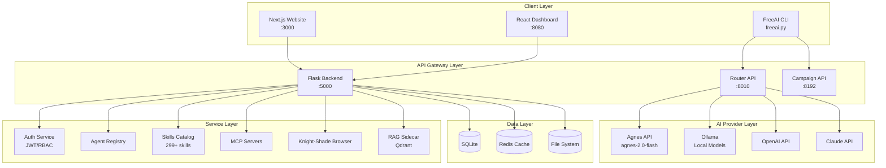

# FreeAI Architecture Diagram

## System Overview

## Component Details

### Client Layer
- **Next.js Website** - Landing page, documentation, agent showcase
- **React Dashboard** - Main UI for FreeAI operations
- **CLI** - Command-line interface for automation

### API Gateway Layer
- **Flask Backend** - Main API server with 562+ endpoints
- **Router API** - LLM request routing with fallback chains
- **Campaign API** - Phishing campaign management

### Service Layer
- **Auth Service** - JWT authentication, RBAC, user management
- **Agent Registry** - 100+ specialized agents
- **Skills Catalog** - 299+ AI skills
- **MCP Servers** - Model Context Protocol integration
- **Knight-Shade Browser** - Stealth browser automation
- **RAG Sidecar** - Vector search with Qdrant

### AI Provider Layer
- **Agnes API** - Primary LLM provider
- **Ollama** - Local model inference
- **OpenAI/Claude** - Third-party providers

### Data Layer
- **SQLite** - Primary database
- **Redis** - Caching layer
- **File System** - Skill storage, configs, logs
