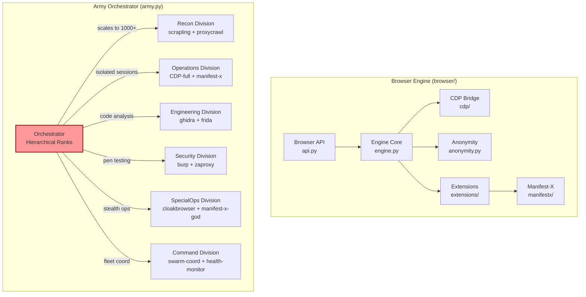
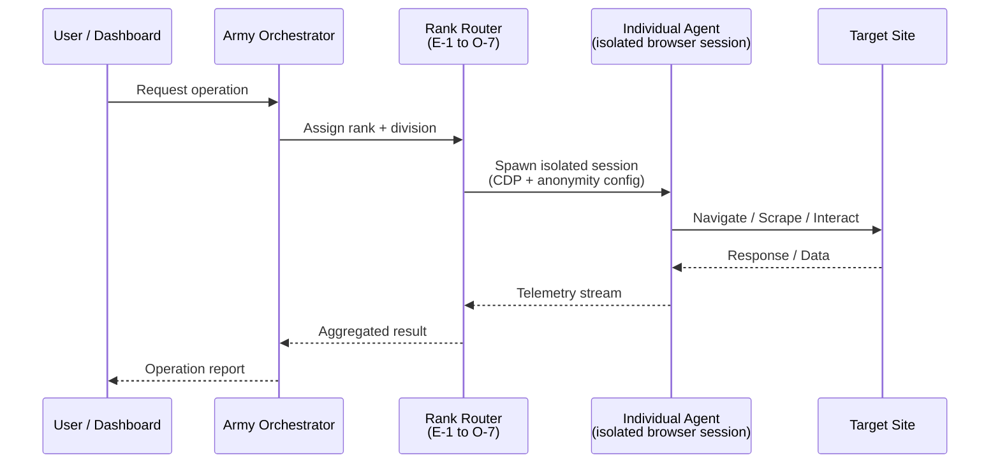
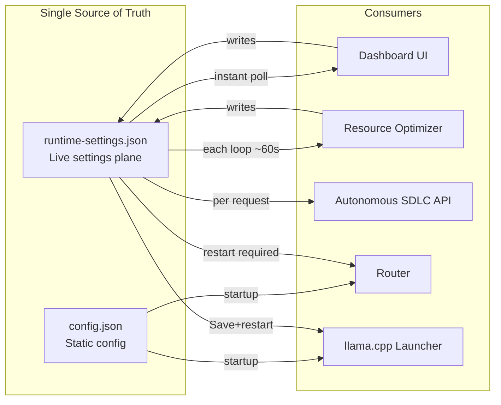
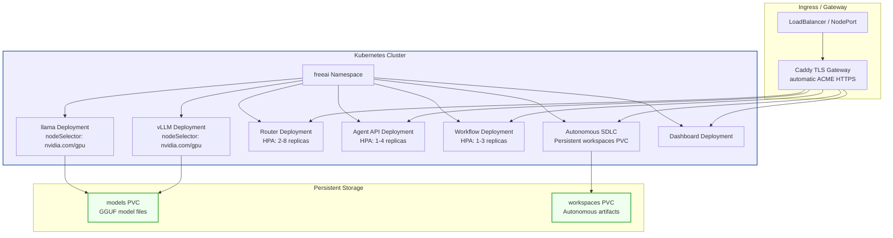

# FreeAI Architecture Guide

## System Overview

FreeAI is a production-grade, self-hosted AI inference workstation that unifies local model inference, autonomous agents, workflow orchestration, and a management dashboard into a single deployable stack.

```mermaid
graph TB
    subgraph Clients ["Clients"]
        UI[Dashboard UI :8030]
        CLI[freeai CLI]
        MCP[MCP Server :8090]
        CODEX[Codex / OpenCode / Claude Code]
    end

    subgraph Services ["FreeAI Services"]
        ROUTER[Router :8010<br/>Task Classifier + Fallback Chain]
        AGENTS[Agent API :8020<br/>Project / Refactor / Debug / Chat]
        WORKFLOW[Workflow Engine :8040<br/>Pipeline Designer]
        AUTONOMOUS[Autonomous SDLC :8050<br/>Plan → Code → Test → Fix]
        DASHBOARD[Dashboard :8030<br/>GPU Telemetry + Control Plane]
        SUPERVISOR[Supervisor<br/>Health + Auto-Restart]
    end

    subgraph Inference ["GPU Inference Layer"]
        LLAMA[llama.cpp :9001<br/>GGUF Inference]
        LLAMA2[llama.cpp :9003<br/>Secondary Model]
        VLLM[vLLM :9002<br/>Optional High-Throughput]
        FREETOKEN[FreeToken :9100<br/>Edge MoE 290B+]
        LOLLMs[LoLLMs :9600<br/>Chat UI]
    end

    subgraph External ["External Providers"]
        OPENAI[OpenAI]
        ANTHROPIC[Anthropic]
        GEMINI[Google Gemini]
        GROQ[Groq]
        DEEPSEEK[DeepSeek]
        OTHERS[21+ More...]
    end

    subgraph Browser ["Browser Engine"]
        ENGINE[Browser Engine<br/>CDP + Manifest-X]
        ARMY[Army Orchestrator<br/>14 Ranks / 6 Divisions]
        ANON[Anonymity Layer<br/>Tor / SOCKS / Stealth]
    end

    subgraph Storage ["Data & Memory"]
        CONFIG[config/config.json<br/>Single Source of Truth]
        RUNTIME[config/runtime-settings.json<br/>Live Settings Plane]
        MEMORY[Agent Session Memory]
        WORKSPACES[Sandboxed Workspaces]
        LOGS[logs/*.jsonl Audit Trail]
        MODELS[models/*.gguf<br/>GGUF Model Registry]
    end

    UI -->|REST + SSE| DASHBOARD
    CLI -->|REST| ROUTER
    CLI -->|REST| AGENTS
    MCP -->|REST| ROUTER
    MCP -->|REST| AGENTS
    MCP -->|REST| WORKFLOW
    MCP -->|REST| AUTONOMOUS
    CODEX -->|MCP| MCP

    ROUTER -->|classify + fallback| LLAMA
    ROUTER -->|classify + fallback| LLAMA2
    ROUTER -->|classify + fallback| VLLM
    ROUTER -->|classify + fallback| FREETOKEN
    ROUTER -->|external bridge| OPENAI
    ROUTER -->|external bridge| ANTHROPIC
    ROUTER -->|external bridge| GEMINI
    ROUTER -->|external bridge| GROQ
    ROUTER -->|external bridge| DEEPSEEK
    ROUTER -->|external bridge| OTHERS

    AGENTS -->|LLM calls| ROUTER
    WORKFLOW -->|LLM calls| AGENTS
    WORKFLOW -->|LLM calls| ROUTER
    AUTONOMOUS -->|LLM calls| AGENTS
    AUTONOMOUS -->|LLM calls| ROUTER

    DASHBOARD -->|polls| SUPERVISOR
    DASHBOARD -->|sse events| RUNTIME
    DASHBOARD -->|gpu telemetry| NVIDIA[nvidia-smi]

    ENGINE -->|CDP sessions| ARMY
    ARMY -->|anonymity config| ANON

    ROUTER -->|cache| CONFIG
    AGENTS -->|session memory| MEMORY
    AUTONOMOUS -->|code| WORKSPACES
    ALL_SERVICES-->|audit trail| LOGS
    LLAMA -->|loads| MODELS
    LLAMA2 -->|loads| MODELS

    style ROUTER fill:#f9d,stroke:#93f,stroke-width:2px
    style AGENTS fill:#bdf,stroke:#36f,stroke-width:2px
    style DASHBOARD fill:#fdb,stroke:#f93,stroke-width:2px
    style LLAMA fill:#bfb,stroke:#393,stroke-width:2px
    style ARMY fill:#fbb,stroke:#f33,stroke-width:2px
    style EXTERNAL fill:#ddd,stroke:#999,stroke-width:1px,stroke-dasharray:5 5
```



## Service Interaction Map

### Request Flow: Client → Router → Model → Response

```mermaid
sequenceDiagram
    participant C as Client (CLI/Dashboard/MCP)
    participant R as Router (:8010)
    participant CL as Classifier
    participant CACHEDB as LRU Cache
    participant RL as Rate Limiter
    participant AUTH as Auth Middleware
    participant SWITCH as Switcher
    participant L1 as llama.cpp :9001
    participant L2 as llama.cpp :9003
    participant V as vLLM :9002
    participant E as External Provider

    C->>R: POST /route {prompt, model?, stream?}
    R->>AUTH: Check X-API-Key
    alt API key required
        AUTH-->>R: 401 Unauthorized
        R-->>C: 401
    end
    R->>RL: Check token bucket (per IP)
    alt Rate limited
        RL-->>R: 429
        R-->>C: 429 Rate Limited
    end
    R->>CACHEDB: Hash(prompt) lookup
    alt Cache HIT
        CACHEDB-->>R: cached response
        R-->>C: {response, X-Cache: HIT}
    end
    R->>CL: classify_task(prompt)
    CL-->>R: {task_type, confidence}
    R->>SWITCH: select_chain(task_type, model?)
    SWITCH-->>R: [primary, fallback1, fallback2, ...]

    loop Fallback Chain
        R->>L1: POST /completion {prompt}
        alt Success
            L1-->>R: {content, elapsed_ms}
            R->>CACHEDB: Store in LRU cache
            R-->>C: {model_used, task_type, confidence,<br/>elapsed_ms, response}
            break
        else Timeout / Error
            R->>L2: POST /completion {prompt}
            alt Success
                L2-->>R: {content, elapsed_ms}
                R->>CACHEDB: Store in LRU cache
                R-->>C: {model_used, task_type,<br/>confidence, elapsed_ms, response}
                break
            else All locals down
                R->>E: POST /chat/completions (external)
                E-->>R: {content} (X-Cache: PASS)
                R-->>C: {model_used, task_type,<br/>elapsed_ms, response}
            end
        end
    end
```

### Browser Engine Architecture



### Army Orchestration Flow



**Ranks:** E-1 (Grunt) through O-7 (Brigadier General) — 14 tiers with decreasing max_agents (50 → 1).

**Divisions:** Recon, Operations, Engineering, Security, SpecialOps, Command — each with specific extension profiles and anonymity defaults.

## Data Flow: Configuration & Settings



## Service Port Map

| Service | Port | Description |
|---|---|---|
| Router | 8010 | Task classification, fallback routing, caching, rate limiting |
| Agent API | 8020 | Project, refactor, debug, analyze, chat agents with profiles |
| Dashboard | 8030 | GPU telemetry, settings, presets, alerts, SSE events |
| Workflow Engine | 8040 | Visual pipeline designer, validation, audit logs |
| Autonomous SDLC | 8050 | Full lifecycle: plan → code → test → fix → package |
| llama.cpp (primary) | 9001 | GGUF inference backend |
| llama.cpp (secondary) | 9003 | Parallel model shard (--profile llama2) |
| vLLM | 9002 | High-throughput serving (optional) |
| FreeToken | 9100 | Edge MoE 290B+ models (optional) |
| LoLLMs | 9600 | Chat UI (optional) |
| JupyterLab | 8888 | Python notebook (optional) |
| MCP Server | 8090 | MCP tools proxy for Codex/OpenCode |
| noVNC | 6080 | Remote desktop (optional) |

## Kubernetes Topology



## Deployment Profiles

| Profile | Services Included | Use Case |
|---|---|---|
| Default | Router, Agents, Workflow, Dashboard, llama | Core inference stack |
| `vllm` | + vLLM backend | High-throughput batch inference |
| `warmup` | One-shot GPU warmup | Post-deploy GPU heat-up |
| `desktop` | + XFCE/VNC/noVNC | Remote desktop access |
| `llama2` | + Secondary llama instance | Parallel model serving |
| `freetoken` | + FreeToken edge MoE | 290B+ models on consumer GPUs |
| `lollms` | + LoLLMs chat UI | Chat-centric frontend |
| `rag` | + Qdrant sidecar | RAG with vector embeddings |
| `tls` | + Caddy TLS gateway | Production HTTPS |
| `allinone` | All services in one container | Simplified single-image deployment |
| `mcp` | + MCP server | Codex/OpenCode integration |
