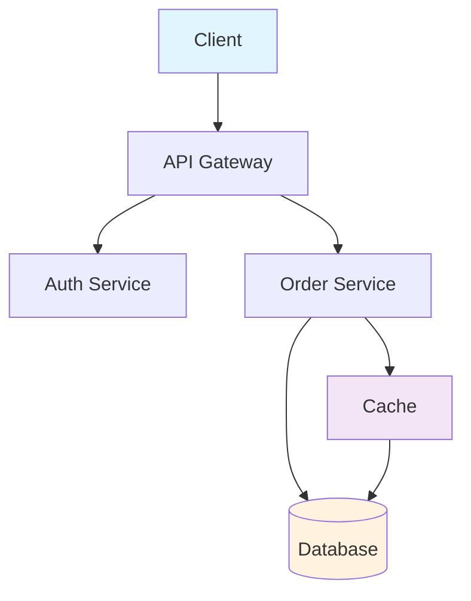
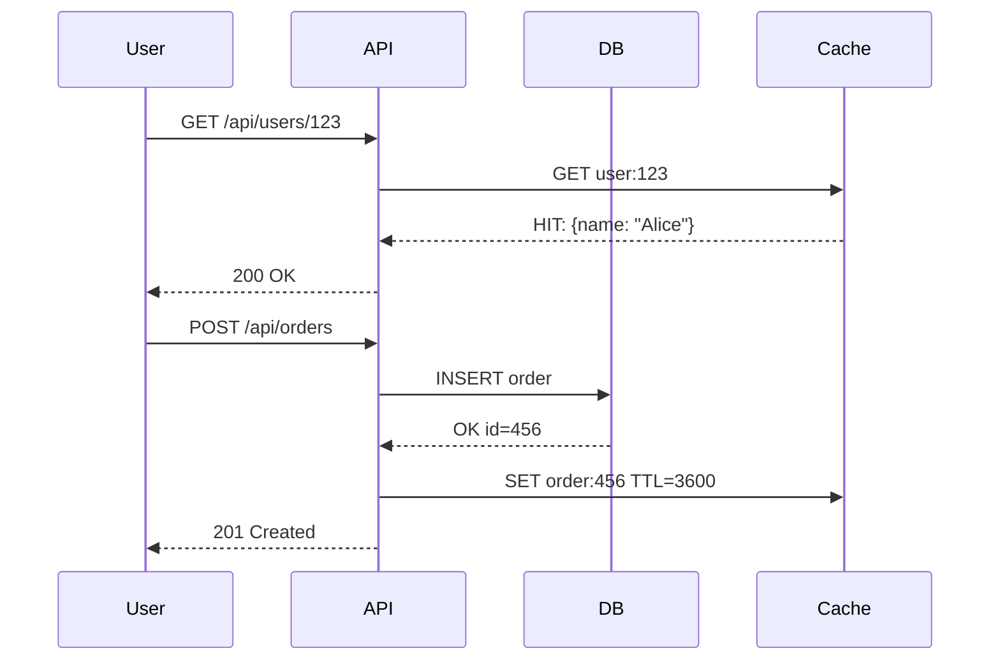
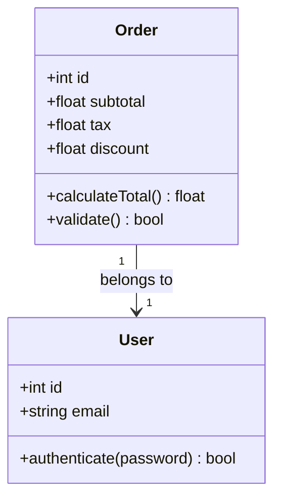
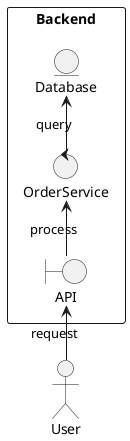

# Doc Generator

## API Reference Generation

### OpenAPI/Swagger from Code

```python
# FastAPI — automatic OpenAPI generation
from fastapi import FastAPI
from pydantic import BaseModel

app = FastAPI(title="My API", version="1.0.0")

class Item(BaseModel):
    name: str
    price: float
    tags: list[str] = []

@app.get("/items/{item_id}")
async def read_item(item_id: int, q: str | None = None):
    """Get an item by ID with optional query filter."""
    return {"item_id": item_id, "q": q}

@app.post("/items/", response_model=Item)
async def create_item(item: Item):
    """Create a new item. Returns the created item."""
    return item

# Generate docs
# python -m uvicorn main:app --reload
# Docs at http://localhost:8000/docs
```

### JSDoc (JavaScript/TypeScript)

```typescript
/**
 * Calculate the total order value including tax and discounts.
 * @param {Order} order - The order to calculate
 * @param {boolean} includeTax - Whether to include tax (default: true)
 * @returns {number} Total order value
 * @throws {Error} If order is invalid
 * @example
 * const total = calculateTotal(order);
 */
function calculateTotal(order: Order, includeTax: boolean = true): number {
    let total = order.subtotal;
    if (includeTax) total += order.tax;
    total -= order.discount;
    return total;
}
```

### Go Doc Comments

```go
// CalculateTotal computes the final order total including tax and discounts.
// It returns an error if the order subtotal is negative.
//
// Example:
//   total, err := CalculateTotal(order)
//   if err != nil {
//       log.Fatal(err)
//   }
func CalculateTotal(order Order) (float64, error) {
    if order.Subtotal < 0 {
        return 0, fmt.Errorf("negative subtotal: %f", order.Subtotal)
    }
    return order.Subtotal + order.Tax - order.Discount, nil
}
```

## Architecture Documentation

### Mermaid Diagrams







### PlantUML



## Inline Documentation

### Docstring Standards

```python
"""Module-level docstring.

This module handles order processing including validation,
pricing, and fulfillment.

Attributes:
    MAX_ORDER_SIZE: Maximum items per order (default: 100)
    TAX_RATE: Current tax rate (default: 0.08)
"""

def process_order(order: Order) -> OrderResult:
    """Process an order and return the result.

    Validates the order, calculates totals, and prepares
    it for fulfillment.

    Args:
        order: The Order object to process.

    Returns:
        OrderResult with status, total, and fulfillment_id.

    Raises:
        ValidationError: If order is invalid.
        InsufficientStockError: If items are out of stock.

    Examples:
        >>> result = process_order(my_order)
        >>> result.status
        'confirmed'
    """
    validate_order(order)
    total = calculate_total(order)
    fulfillment_id = fulfill(order, total)
    return OrderResult(status="confirmed", total=total, fulfillment_id=fulfillment_id)
```

### README Structure

```markdown
# Project Name

One-line description of what this project does.

## Installation

\`\`\`bash
pip install -r requirements.txt
# or
npm install
\`\`\`

## Usage

\`\`\`python
from project import MyClass
obj = MyClass()
result = obj.run()
\`\`\`

## API Reference

| Function | Description | Params | Returns |
|----------|-------------|--------|---------|
| \`run()\` | Execute main logic | config: dict | Result |

## Architecture

\`\`\`
┌─────────┐     ┌─────────┐     ┌─────────┐
│  Client  │────▶│  API    │────▶│ Database│
└─────────┘     └─────────┘     └─────────┘
\`\`\`

## Testing

\`\`\`bash
pytest tests/ -v --cov=src
\`\`\`

## Contributing

1. Fork the repository
2. Create a feature branch
3. Run tests: \`pytest\`
4. Submit a pull request
```

## Configuration-Driven Docs

```yaml
# docs-config.yaml
project:
  name: MyAPI
  version: 1.0.0
  description: "REST API for order management"

sources:
  - path: src/
    language: python
    parser: sphinx

output:
  format: markdown
  dest: docs/
  include:
    - api_reference
    - architecture
    - examples

templates:
  function: |
    ### {name}
    
    {summary}
    
    **Parameters:**
    {params}
    
    **Returns:** {returns}
    
    **Raises:** {raises}
```

## Doc Generation Commands

```bash
# Python — Sphinx
sphinx-apidoc -o docs/ src/
make html

# Python — pdoc
pdoc src/ --html -o docs/

# TypeScript — TypeDoc
npx typedoc src/index.ts

# Go — godoc
go doc ./...
# or
golangci-docgen

# Rust — rustdoc
cargo doc --no-deps --open

# Java — Javadoc
javadoc -d docs/ src/**/*.java
```

## Documentation Checklist

- [ ] All public functions have docstrings
- [ ] API endpoints documented with request/response schemas
- [ ] Architecture diagram included
- [ ] Installation instructions tested
- [ ] Code examples work (run them)
- [ ] CHANGELOG updated
- [ ] CONTRIBUTING guide present
- [ ] License file included
- [ ] README link to full docs
